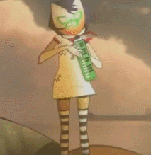

# programas-c

Olá! Este é um repositório para programas em C. Vou tentar colocar a maioria dos programas que eu achar legal, sejam feitos por exercícios da matéria de Introdução às Técnicas de Programação (ITP), sejam feitos por curiosidade. Até!

_Nota: Todos os diretórios possuem um README.md, um arquivo em C e um arquivo binário gerado pelo GCC (Ubuntu 22.04). Deixo os binários caso queira rodar no seu computador, mas caso seu sistema operacional não seja uma distribuição Linux, talvez o arquivo binário não rode. Com isso avisado, enjoy!_ 
