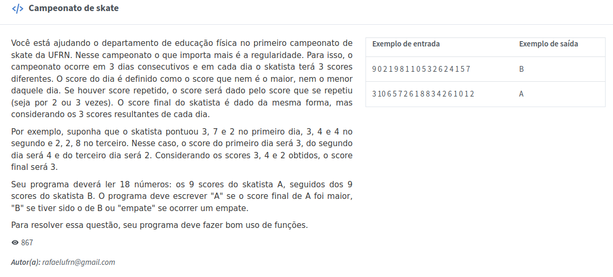

# Campeonato de skates da UFRN! B)

Esse eu tô com preguiça de explicar como funciona. Vou deixar a imagem do problema em questão: 

_Este programa foi feito como exercício de uma das provas virtuais (lop.natalnet.br) de Introdução às Técnicas de Programação (ITP), do IMD/UFRN._
